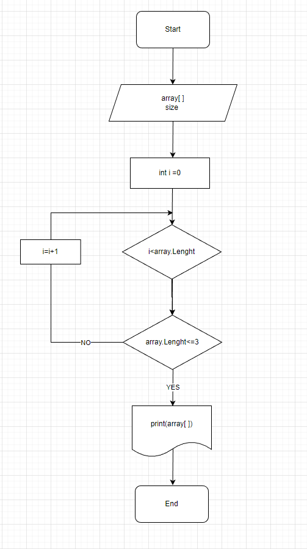

# **Моя итоговая проверочная работа включала следующие этапы**  

## 1. Создание пустого репозитория в GitHub под названием **Itogovay_I_chetvert_Petrovoi_Irini**.
  
## 2. Отрисовка блок-схемы алгоритма основной содержательной части:
  

## 3. Создание в репозитории оформленного текстового описания решения в файле **Reshenie.md**

## 4. Использование контроля версий в работе над этим проектом, который содержит в себе несколько коммитов.

